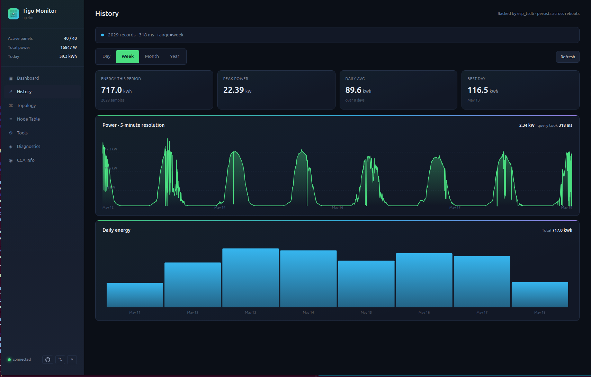
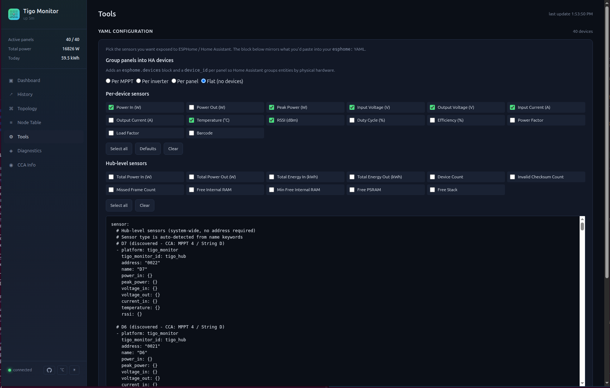
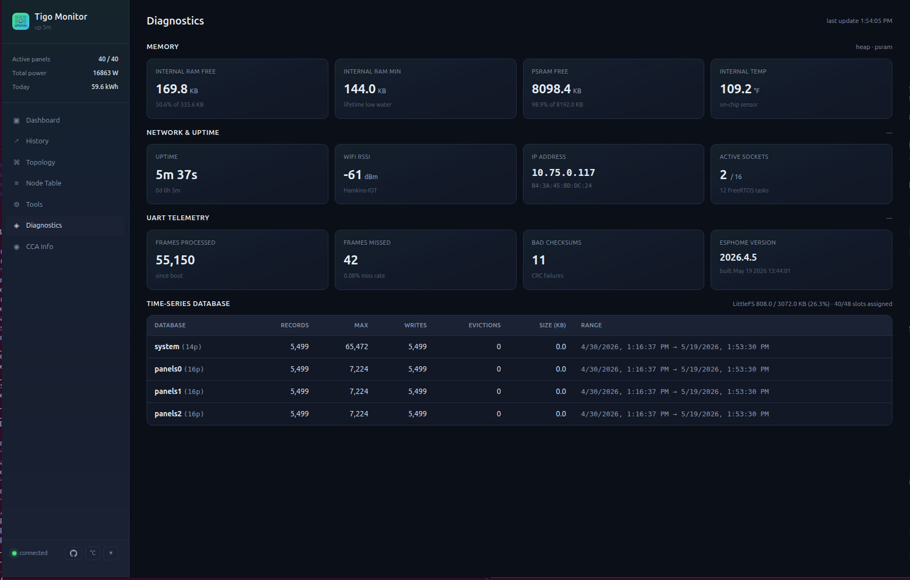

# ESPHome Tigo Monitor

An ESPHome component for monitoring Tigo solar optimizers via RS485/UART. Real-time monitoring of individual devices with Home Assistant integration.


## Features

- **Device Monitoring** – Voltage, current, power, temperature, RSSI per optimizer
- **System Aggregation** – Total power, energy (kWh), active device count, peak tracking
- **Built-in Single-Page Web App** – Dashboard heatmap, history, topology, nodes, tools, diagnostics, CCA info, Tigo Cloud
- **Panel Detail Modal** – Click any panel heat tile to see live readings (V/I/W, temp, RSSI, efficiency, duty cycle) and a power-history chart with a string-median overlay so you can tell a single-panel dip apart from string-wide shading
- **Sortable Node Table** – Every column header is clickable; arrow indicator marks the active sort; numeric columns default to "biggest first"
- **On-Flash History** – Per-snapshot rollups + per-panel power persisted via [esp_tsdb](https://github.com/zakery292/esp_tsdb); survives reboots and OTA updates
- **CCA Integration** – Auto-sync panel names from Tigo Cloud Connect Advanced (local HTTP, **CCA over Bluetooth** for HTTP-locked firmware 4.0.4+, or **Tigo cloud** layout import)
- **CCA over Bluetooth** – Read CCA info / network and configure WiFi / run discovery over BLE; a **Bluetooth search** finds the CCA by its address prefix and stores the chosen MAC on-device (no YAML edit)
- **Tigo Cloud** – Recover the panel/string/MPPT layout and view Tigo's per-equipment health, status, and history (token-only credential storage)
- **On-Device Configuration** – Tune `power_calibration`, night-mode timeout, midnight reset, and more from the web UI, persisted to NVS over the YAML defaults — no reflash
- **In-UI Naming** – Friendly inverter and string names settable from Topology view, persisted to NVS (YAML stays the source of truth for identity)
- **Per-String Nameplate** – Set the rated watts per panel; health classification and "% of rated" readouts use it
- **Sub-Device YAML Generator** – Tools view emits an `esphome.devices:` block and propagates `device_id` to each child sensor, with per-MPPT / per-inverter / per-panel / flat grouping
- **Home Assistant** – Energy Dashboard compatible, full API integration, Ingress-proxy friendly

## Upgrading from a previous version

> ⚠ **One-time data loss + serial-flash required on this release.**
>
> This release reshapes the flash partition layout to make room for the new on-flash time-series database (TSDB). The repartition wipes the existing app, NVS, and any saved state on the device, and the new image can't be applied over OTA — the bootloader and partition table need to be written too.
>
> **Before you upgrade:**
> 1. Open **Tools → Export** (or the legacy `/nodes` page) and save the JSON. This is the only state worth preserving — friendly names, CCA assignments, slot map.
> 2. Flash the new firmware over **USB / serial** (e.g. `esphome run boards/<your-board>.yaml --device /dev/ttyACM0`). OTA will not work for this jump.
> 3. After first boot, open **Tools → Import** and restore the JSON.
>
> Subsequent updates (within this partition layout) can use OTA again.

## Requirements

| Requirement | Details |
|-------------|---------|
| **Hardware** | ESP32-S3 with PSRAM recommended (e.g., M5Stack AtomS3R) |
| **Connection** | RS485 to Tigo system at 38400 baud |
| **Framework** | ESP-IDF (not Arduino) |
| **ESPHome** | 2026.5.0+ (needed for `allow_partition_access` OTA) |

> **Note:** PSRAM is strongly recommended for 15+ devices. Without PSRAM, expect instability with web interface usage.

## Quick Start

### 1. Hardware Setup

Connect ESP32 to Tigo system via RS485:
- **TX:** GPIO6 → Tigo RX
- **RX:** GPIO5 → Tigo TX  
- **Baud:** 38400, 8N1

**Recommended:** [M5Stack Atomic RS485 Base](https://docs.m5stack.com/en/atom/Atomic%20RS485%20Base) for easy connection.

### 2. Basic Configuration

```yaml
esphome:
  name: tigo-monitor
  min_version: "2026.5.0"  # required for allow_partition_access (OTA)

esp32:
  board: esp32-s3-devkitc-1
  framework:
    type: esp-idf
    sdkconfig_options:
      CONFIG_UART_ISR_IN_IRAM: "y"

external_components:
  - source:
      type: git
      url: https://github.com/RAR/esphome-tigomonitor
    components: [ tigo_monitor, tigo_server ]
    refresh: 0s

logger:

wifi:
  ssid: !secret wifi_ssid
  password: !secret wifi_password

api:
ota:
  - platform: esphome
    # Lets future partition-table changes apply over OTA (ESPHome 2026.5.0+)
    allow_partition_access: true

uart:
  id: tigo_uart
  tx_pin: GPIO6
  rx_pin: GPIO5
  baud_rate: 38400

tigo_monitor:
  id: tigo_hub
  uart_id: tigo_uart
  update_interval: 30s
  number_of_devices: 20
  cca_ip: "192.168.1.100"  # Optional: Your CCA IP
  stale_timeout: 10  # Minutes without data before a device's production zeroes (0 = off)

tigo_server:
  tigo_monitor_id: tigo_hub
  port: 80
```

### 3. Add Sensors

> **Important:** You must declare `sensor:`, `text_sensor:`, and `binary_sensor:` sections
> (even if empty) so ESPHome generates the required C++ headers. Without them, compilation will fail
> with `fatal error: esphome/components/sensor/sensor.h: No such file or directory`.

```yaml
sensor:
  # System totals
  - platform: tigo_monitor
    tigo_monitor_id: tigo_hub
    name: "Total System Power"
    
  - platform: tigo_monitor
    tigo_monitor_id: tigo_hub
    name: "Total System Energy"

  # Individual device (address from web UI discovery)
  - platform: tigo_monitor
    tigo_monitor_id: tigo_hub
    address: "1234"
    name: "Panel 1"
    power: {}
    voltage_in: {}
    voltage_out: {}
    current_in: {}
    temperature: {}
    efficiency: {}

  # Per-string aggregate — one entity per string instead of one per panel.
  # The label is the CCA string label (shown in the Node Table / Topology).
  - platform: tigo_monitor
    tigo_monitor_id: tigo_hub
    string_label: "A"
    name: "String A Power"

  # Alert counts for HA notifications: panels gone silent vs panels
  # reporting but producing nothing (both publish 0 in night mode)
  - platform: tigo_monitor
    tigo_monitor_id: tigo_hub
    name: "Stale Panel Count"
  - platform: tigo_monitor
    tigo_monitor_id: tigo_hub
    name: "Zero Production Count"

# Required even if empty — ensures ESPHome generates component headers
text_sensor:

binary_sensor:
```

### 4. Access Web Interface

Navigate to `http://<esp32-ip>/` — you land on the Dashboard view of the single-page app at `/app#dashboard`. Sidebar nav switches between views; the URL hash updates so views are deep-linkable.

| View | URL | Description |
|------|-----|-------------|
| Dashboard | `/app#dashboard` | Hero strip + per-string heatmap + alerts |
| History | `/app#history` | TSDB-backed power & energy charts (day / week / month / year) |
| Topology | `/app#topology` | Inverter → string → panel hierarchy with live V/I/W/°C, rename + nameplate editing |
| Node Table | `/app#nodes` | Device registry with CCA labels, export/import |
| Tools | `/app#tools` | Device Configuration (on-device knobs) + YAML generator + Reset Peak / Clear Nodes / Restart |
| Diagnostics | `/app#diagnostics` | Memory, network, UART telemetry, TSDB stats |
| CCA Info | `/app#cca` | CCA status (HTTP or BLE); refresh, Bluetooth search, network/WiFi config, discovery |
| Tigo Cloud | `/app#cloudstatus` | Tigo-cloud health, per-equipment status + history (when `cloud_import` is set) |

Legacy paths (`/`, `/nodes`, `/status`, `/yaml`, `/cca`, `/history`) all 302 to the corresponding `#view`.

### Gallery

| View | Screenshot |
|------|------------|
| Dashboard — hero strip, per-string heatmap, click any panel for the detail modal |  |
| History — TSDB-backed power chart with gradient fill + daily energy bars |  |
| Tools — YAML generator with per-MPPT / per-inverter / per-panel / flat sub-device grouping |  |
| Diagnostics — memory / network / UART / per-DB TSDB stats |  |

## PSRAM & large installs

**PSRAM is required for 15+ devices.** The recommended M5Stack AtomS3R has it; on a generic ESP32-S3 (e.g. DevKitC-1) enable the `psram:` component. The full board blocks — octal-mode sdkconfig flags, the erase-flash-when-enabling-PSRAM caveat, and internal-RAM tuning for 30+ device arrays (`CONFIG_SPIRAM_TRY_ALLOCATE_WIFI_LWIP`, entity-count budgeting, UART buffer sizing) — live in the [Configuration Guide → ESP-IDF framework & PSRAM](docs/CONFIGURATION.md#esp-idf-framework). Ready-to-flash examples are in [`boards/`](boards/).

## API Endpoints

All endpoints return JSON with optional Bearer-token auth. Common ones:

| Endpoint | Description |
|----------|-------------|
| `/api/overview` | System aggregates (power, energy, device counts) |
| `/api/devices` | Per-device metrics with string labels |
| `/api/inverters` | Per-inverter rollups + embedded strings |
| `/api/history/power?range=…` | TSDB-backed system power/energy series |
| `/api/config` | Runtime config values; POST to set/revert (Device Configuration) |
| `/api/health` | Health check (no auth) |

See the [Web Server & API reference](docs/WEB_SERVER_README.md#api-endpoints) for the full endpoint list (reads, writes, payloads) and the `button:` management actions.

## Documentation

| Document | Description |
|----------|-------------|
| [Wiring Guide](docs/WIRING.md) | RS485 connection to Tigo CCA/TAP |
| [Configuration Guide](docs/CONFIGURATION.md) | Full configuration options |
| [Web Server](docs/WEB_SERVER_README.md) | SPA + API reference |
| [TSDB Integration](docs/tsdb-integration.md) | On-flash time-series history (esp_tsdb) |
| [Troubleshooting](docs/TROUBLESHOOTING.md) | Common issues and solutions |
| [Home Assistant](docs/HOME_ASSISTANT.md) | HA integration and dashboards |
| [UART Optimization](docs/UART_OPTIMIZATION.md) | Reducing packet loss |

## Project Structure

```
components/
├── tigo_monitor/     # Main component (UART parsing, sensors)
└── tigo_server/      # Web server (dashboard, API)
boards/               # Example board configurations
docs/                 # Documentation
examples/             # HA dashboards and automations
```

## Contributing

1. Fork the repository
2. Create a feature branch
3. Test thoroughly
4. Submit a pull request

## License

MIT License – see [LICENSE](LICENSE) for details.

## Acknowledgments

Built on work by:
- [Bobsilvio/tigo_server](https://github.com/Bobsilvio/tigo_server)
- [Bobsilvio/tigosolar-local](https://github.com/Bobsilvio/tigosolar-local)
- [willglynn/taptap](https://github.com/willglynn/taptap)
- [tictactom/tigo_server](https://github.com/tictactom/tigo_server)

---

*All trademarks are property of their respective owners.*
