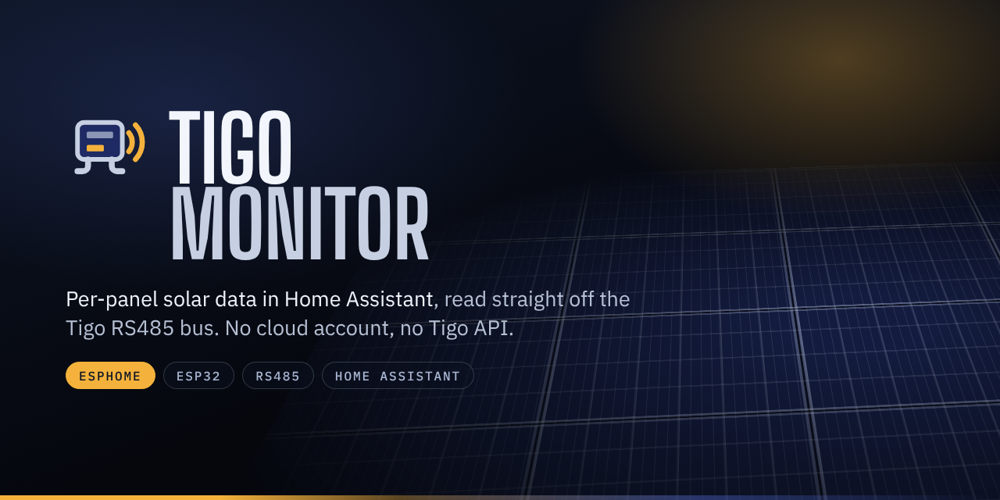
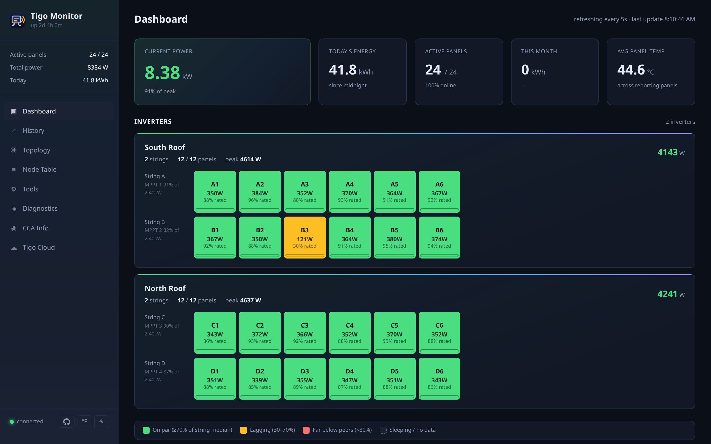
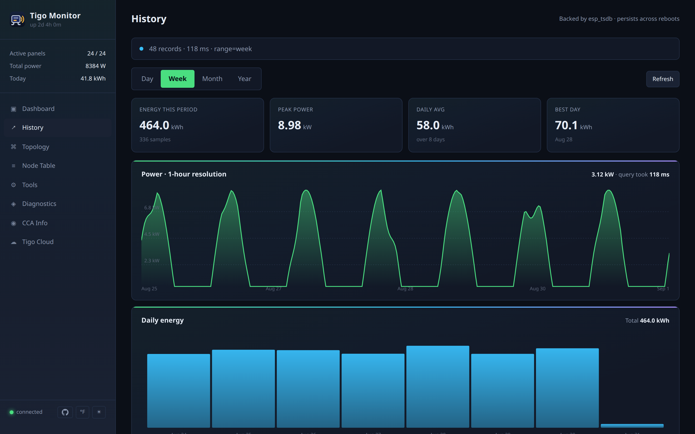
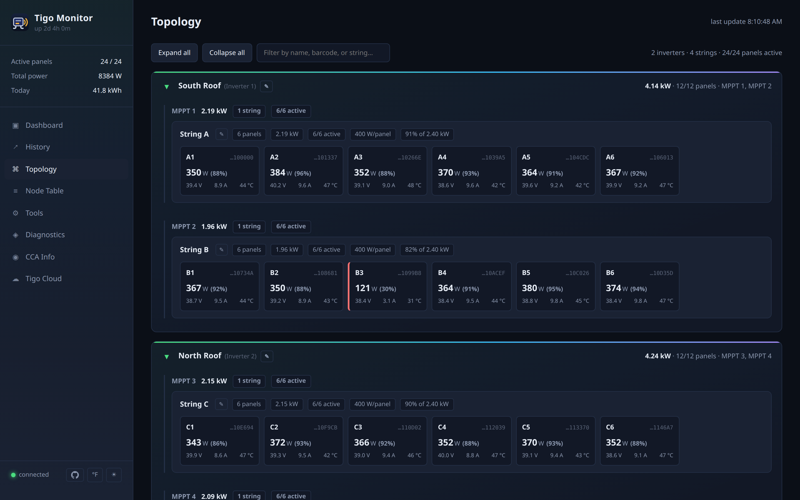
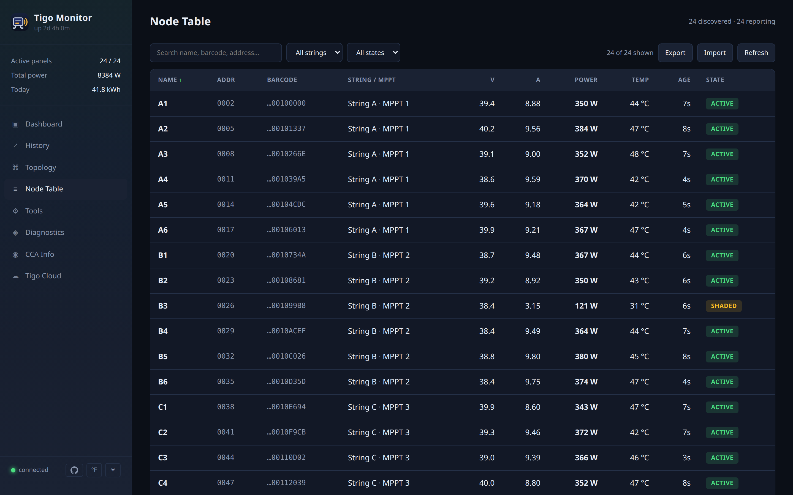
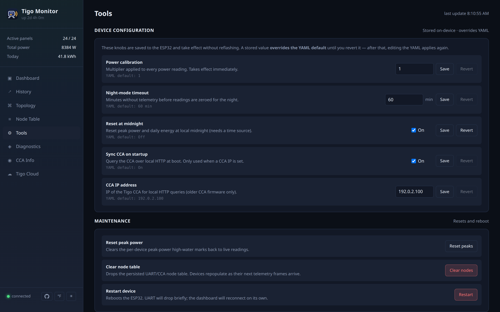
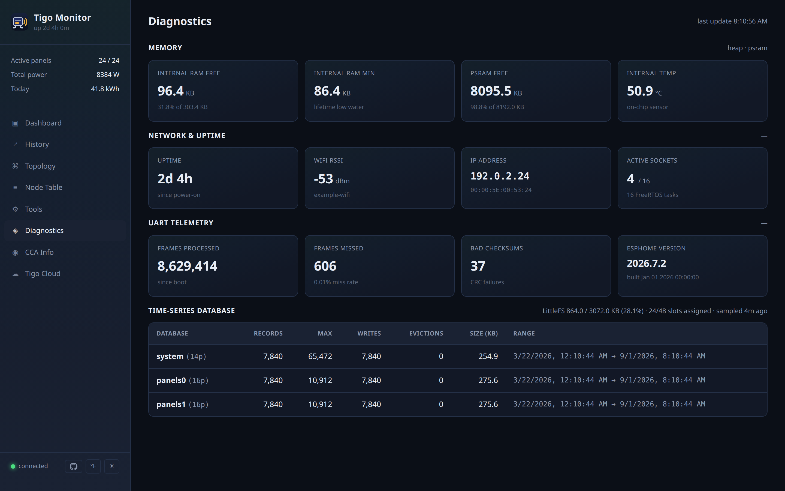

An ESPHome component for monitoring Tigo solar optimizers via RS485/UART. Real-time
per-panel monitoring with a built-in web app and Home Assistant integration.

📖 **[Documentation](https://rar.github.io/esphome-tigomonitor/)** &nbsp;·&nbsp; 🚀 **[Start Here](https://rar.github.io/esphome-tigomonitor/guides/getting-started/)** &nbsp;·&nbsp; 🔧 **[Config Builder](https://rar.github.io/esphome-tigomonitor/config-builder/)** — generate a ready-to-flash YAML in your browser

## Features

- **Per-Device Monitoring** – Voltage, current, power, temperature, RSSI per optimizer,
  plus system aggregates (total power, energy, active count, peak tracking)
- **Built-in Single-Page Web App** – Dashboard heatmap, history, topology, node table,
  tools, diagnostics, CCA info, Tigo Cloud
- **On-Flash History** – Per-snapshot rollups and per-panel power persisted via
  [esp_tsdb](https://github.com/zakery292/esp_tsdb); survives reboots and OTA
- **CCA Integration** – Auto-sync panel names over local HTTP, **Bluetooth** (for
  HTTP-locked firmware 4.0.4+), or **Tigo cloud** layout import
- **On-Device Configuration** – Calibration, night mode, friendly names and per-string
  nameplate set from the web UI and persisted to NVS — no reflash
- **Home Assistant** – Energy Dashboard compatible, full API integration, Ingress-friendly

## Requirements

| Requirement | Details |
|-------------|---------|
| **Hardware** | ESP32-S3 **with PSRAM** (e.g. M5Stack AtomS3R) |
| **Connection** | RS485 to Tigo system at 38400 baud |
| **Framework** | ESP-IDF (not Arduino) |
| **ESPHome** | 2026.5.0+ (needed for `allow_partition_access` OTA) |

**PSRAM is required.** The recommended AtomS3R has it.

## Quick Start

1. Wire an ESP32 to the Tigo RS485 bus — see the [Wiring Guide](https://rar.github.io/esphome-tigomonitor/guides/wiring/).
2. Generate a config with the [Config Builder](https://rar.github.io/esphome-tigomonitor/config-builder/),
   or start from a ready-to-flash example in [`boards/`](boards/).
3. `esphome run your-config.yaml`, then open `http://<esp32-ip>/`.

The full walkthrough — parts list, safety, sensor blocks, PSRAM tuning — is in
[Start Here](https://rar.github.io/esphome-tigomonitor/guides/getting-started/).

> ⚠ **Upgrading from a pre-TSDB release: one-time data loss + serial flash required.**
> The partition layout changed to make room for the on-flash time-series database, so
> the new image can't go over OTA and NVS is wiped. Export your JSON from **Tools →
> Export** first, flash over USB/serial, then re-import. Later updates use OTA again.

## Gallery

| View | Screenshot |
|------|------------|
| Dashboard — hero strip, per-string heatmap, click any panel for the detail modal |  |
| History — TSDB-backed power chart with gradient fill + daily energy bars |  |
| Topology — inverter → string → panel tree, inline rename and nameplate editing |  |
| Node Table — every discovered device, sortable and filterable, JSON export/import |  |
| Tools — on-device configuration + YAML generator with sub-device grouping |  |
| Diagnostics — memory / network / UART / per-DB TSDB stats |  |

## Documentation

Full documentation lives at **[rar.github.io/esphome-tigomonitor](https://rar.github.io/esphome-tigomonitor/)**.

| Document | Description |
|----------|-------------|
| [Start Here](https://rar.github.io/esphome-tigomonitor/guides/getting-started/) | Parts, safety, and the five steps to a live dashboard |
| [Config Builder](https://rar.github.io/esphome-tigomonitor/config-builder/) | Generate a ready-to-flash ESPHome YAML for your board |
| [Wiring Guide](https://rar.github.io/esphome-tigomonitor/guides/wiring/) | RS485 connection to Tigo CCA/TAP |
| [Configuration Guide](https://rar.github.io/esphome-tigomonitor/guides/configuration/) | Full configuration options, PSRAM and large installs |
| [Web Server](https://rar.github.io/esphome-tigomonitor/guides/web-server/) | SPA views and the full API reference |
| [TSDB Integration](https://rar.github.io/esphome-tigomonitor/guides/tsdb-integration/) | On-flash time-series history (esp_tsdb) |
| [Home Assistant](https://rar.github.io/esphome-tigomonitor/guides/home-assistant/) | HA integration and dashboards |
| [UART Optimization](https://rar.github.io/esphome-tigomonitor/guides/uart-optimization/) | Reducing packet loss |
| [Troubleshooting](https://rar.github.io/esphome-tigomonitor/guides/troubleshooting/) | Common issues and solutions |

## Contributing

Fork the repo, branch off `main`, and open a pull request back to `main`.

**Firmware changes.** There is no unit-test suite for the C++ — it's compiled and
run on real hardware:

```bash
esphome compile boards/esp32s3-atoms3r.yaml   # check it builds
esphome run boards/esp32s3-atoms3r.yaml       # build, flash, and watch logs
```

Please say in the PR which board you tested on and roughly how many optimizers were
on the bus — behaviour differs a lot between a 4-panel bench setup and a 36-panel roof.

**Docs and web UI.** The site is Astro/Starlight under `site/`:

```bash
cd site
npm install
npm run dev          # local docs preview
npm test             # config-builder, YAML and fixture-privacy checks
npm run screenshots  # re-render docs/images/ from the real app.html
```

Screenshots are generated, not hand-captured: `site/screenshots/capture.mjs` drives
the real `app.html` against synthetic fixtures in `site/screenshots/fixtures.mjs`.
If you change the shape of an `/api/*` response, update those fixtures in the same
commit and re-run `npm run screenshots` — a stale fixture doesn't fail the build, it
just publishes a screenshot of a UI rendering `undefined`. The fixtures must never
contain real serials, site IDs, MACs, SSIDs or IPs; `npm test` enforces this.

See [CLAUDE.md](CLAUDE.md) for the component architecture and the conventions the
codebase follows.

## License

MIT License – see [LICENSE](LICENSE) for details.

## Acknowledgments

Built on work by:
- [Bobsilvio/tigo_server](https://github.com/Bobsilvio/tigo_server)
- [Bobsilvio/tigosolar-local](https://github.com/Bobsilvio/tigosolar-local)
- [willglynn/taptap](https://github.com/willglynn/taptap)
- [tictactom/tigo_server](https://github.com/tictactom/tigo_server)

---

*All trademarks are property of their respective owners.*
