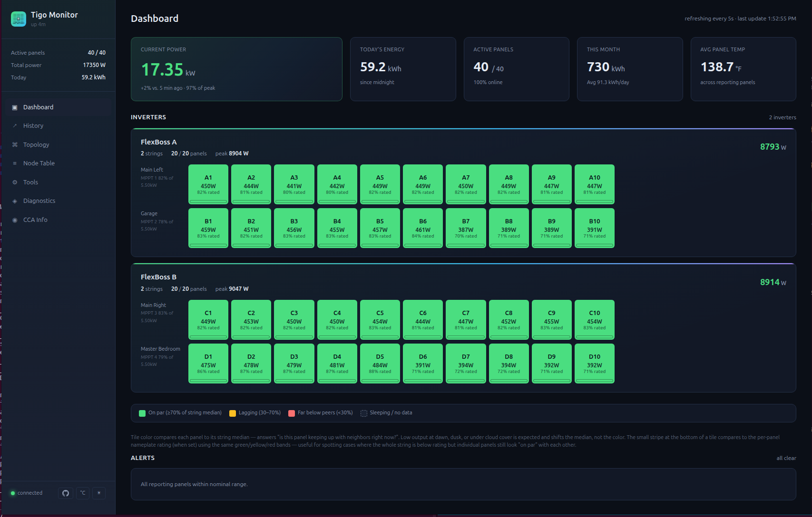
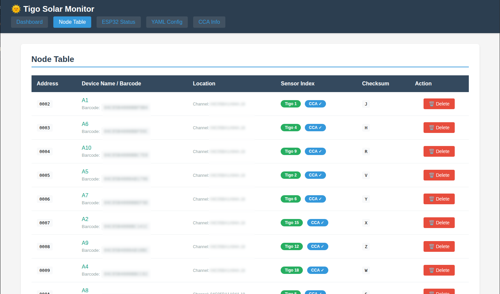
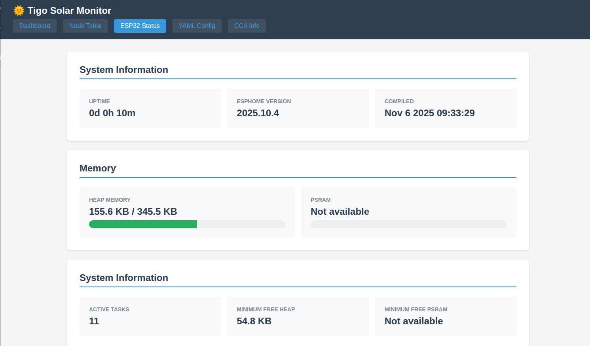

# Web Server & API

The Tigo Monitor includes a built-in web server with dashboard and RESTful API.

## Pages

| Page | URL | Description |
|------|-----|-------------|
| Dashboard | `/` | Real-time system overview with device cards |
| Node Table | `/nodes` | Device registry with CCA labels |
| ESP32 Status | `/status` | System health, memory, uptime |
| YAML Config | `/yaml` | Auto-generated sensor configuration |
| CCA Info | `/cca` | Tigo CCA device status |



---

## Dashboard Features

### System Statistics
Six stat cards showing real-time metrics:
- Total Power (W)
- Total Current (A)
- Total Energy (kWh)
- Active Devices
- Average Efficiency (%)
- Average Temperature

### Device Cards
- CCA-friendly names (e.g., "East Roof Panel 3")
- Two-line headers: CCA label + barcode/address
- Power, voltage, current, temperature, efficiency, RSSI
- Data age indicators
- Peak power tracking

### UI Features
- **Temperature Toggle**: Switch °F/°C (saved to localStorage)
- **Dark Mode**: Persistent preference
- **Auto-refresh**: Updates every 5 seconds
- **Mobile Responsive**: Optimized for all screen sizes
- **String Grouping**: Devices organized by MPPT/string

---

## Node Table



- Complete device list with sensor assignments
- CCA panel names and hierarchy (MPPT → String → Panel)
- Barcode information (Frame 27, 16-char)
- Validation badges for CCA-matched devices
- Delete individual nodes with confirmation

---

## ESP32 Status



- **System Info**: Uptime, ESPHome version, compile time
- **Memory**: Heap and PSRAM usage with progress bars
- **Minimum Free**: Lowest memory (detect leaks)
- **Task Count**: Active FreeRTOS tasks
- **Restart Button**: Remote system restart

---

## API Endpoints

All endpoints return JSON. Auto-refresh every 5-30 seconds.

| Endpoint | Description |
|----------|-------------|
| `/api/devices` | Device metrics with string labels |
| `/api/overview` | System-wide aggregates |
| `/api/strings` | Per-string aggregated data |
| `/api/nodes` | Node table with CCA metadata |
| `/api/status` | ESP32 system status |
| `/api/yaml` | Generated YAML configuration |
| `/api/cca` | CCA connection info |
| `/api/inverters` | Per-inverter aggregates |
| `/api/restart` | Trigger system restart |
| `/api/health` | Health check (no auth) |

### Example Response

```bash
curl http://192.168.1.100/api/overview
```

```json
{
  "total_power": 4523.5,
  "total_current": 12.3,
  "total_energy": 45.6,
  "active_devices": 20,
  "avg_efficiency": 96.2,
  "avg_temperature": 42.5
}
```

---

## Authentication

### API Authentication (Bearer Token)

```yaml
tigo_server:
  tigo_monitor_id: tigo_hub
  api_token: "your-secret-token"
```

Usage:
```bash
curl -H "Authorization: Bearer your-secret-token" http://esp32/api/devices
```

### Web Authentication (HTTP Basic)

```yaml
tigo_server:
  tigo_monitor_id: tigo_hub
  web_username: "admin"
  web_password: "secure-password"
```

Browser prompts for credentials. Cached per session.

### Health Check

`/api/health` requires no authentication:

```bash
curl http://esp32/api/health
```

```json
{
  "status": "ok",
  "uptime": 12345,
  "heap_free": 245760,
  "heap_min_free": 198432
}
```

---

## Home Assistant Ingress

The web UI supports proxying through Home Assistant's reverse proxy with a dynamic URL prefix, compatible with both [Home Assistant Ingress](https://developers.home-assistant.io/docs/add-ons/presentation/#ingress) and the community [hass_ingress](https://github.com/lovelylain/hass_ingress) integration.

To enable ingress support, add the following to your `sdkconfig_options` so the ESP-IDF HTTP server can handle the longer URIs and headers that HA Ingress generates:

```yaml
esp32:
  framework:
    type: esp-idf
    sdkconfig_options:
      CONFIG_HTTPD_MAX_REQ_HDR_LEN: "2048"
      CONFIG_HTTPD_MAX_URI_LEN: "1024"
```

The component automatically detects the ingress base path from the `X-Ingress-Path` header and rewrites all internal links accordingly — no additional configuration required.

---

## Configuration

```yaml
tigo_server:
  tigo_monitor_id: tigo_hub
  port: 80
  api_token: "optional-token"
  web_username: "optional-user"
  web_password: "optional-pass"
```

| Option | Type | Default | Description |
|--------|------|---------|-------------|
| `tigo_monitor_id` | ID | Required | Reference to tigo_monitor |
| `port` | Integer | 80 | HTTP port |
| `api_token` | String | None | Bearer token for API |
| `web_username` | String | None | HTTP Basic Auth user |
| `web_password` | String | None | HTTP Basic Auth pass |

---

## Technical Details

- **Framework**: ESP-IDF native HTTP server
- **Stack size**: 8KB per request
- **Max handlers**: 16 routes
- **CORS**: Enabled for external access
- **Memory**: PSRAM-backed when available

---

## Example URLs

If ESP32 IP is `192.168.1.100`:

```
http://192.168.1.100/           # Dashboard
http://192.168.1.100/nodes      # Node Table
http://192.168.1.100/status     # ESP32 Status
http://192.168.1.100/yaml       # YAML Config
http://192.168.1.100/cca        # CCA Info
http://192.168.1.100/api/devices  # JSON API
```

---

## Browser Compatibility

Works with all modern browsers:
- Chrome / Edge
- Firefox
- Safari
- Mobile browsers

No plugins required. All processing on-device.
