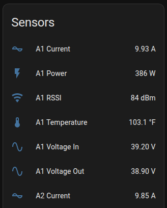

This guide shows you how to surface Tigo Monitor data in Home Assistant — the Energy Dashboard, custom Lovelace views, automations, and the REST API. It's written for hobbyist and prosumer solar owners running Home Assistant alongside the ESPHome device.

> **You may not need any of this.** The device already serves a full built-in web dashboard — a single-page app — at `http://<device-ip>/`. It shows per-string heatmaps, live panel readings, alerts, and topology out of the box, and it works under Home Assistant Ingress with no extra configuration. Hand-building Lovelace cards is an **optional** customization path, not a requirement. See [Web Server & API](/esphome-tigomonitor/guides/web-server/) for the SPA and Ingress details.

## A note on entity names

Every example below uses entity IDs that Home Assistant derives from the ESPHome `name:` field. When you set `name: "Total System Power"`, ESPHome exposes it as `sensor.total_system_power` (lowercased, spaces become underscores). So map each example to whatever you named the sensor in your own YAML.

This guide uses one consistent convention throughout:

| ESPHome `name:` | Home Assistant entity |
|-----------------|-----------------------|
| `Total System Power` | `sensor.total_system_power` |
| `Total System Energy` | `sensor.total_system_energy` |
| `Active Device Count` | `sensor.active_device_count` |
| `East Panel 1` (power) | `sensor.east_panel_1_power` |
| `East Panel 1` (efficiency) | `sensor.east_panel_1_efficiency` |
| `Solar Night Mode` | `binary_sensor.solar_night_mode` |

## Energy Dashboard

The component provides sensors compatible with Home Assistant's Energy Dashboard.



### Setup

1. Go to **Settings → Dashboards → Energy**.
2. Under **Solar Panels**, click **Add Solar Production**.
3. Select `sensor.total_system_energy` (or whatever you named your energy sensor).

### Required Sensor

```yaml
sensor:
  - platform: tigo_monitor
    tigo_monitor_id: tigo_hub
    name: "Total System Energy"  # Must include "energy" in the name
```

---

## Ready-to-Use Dashboards

The repository includes complete dashboard configurations in `/examples/`:

| File | Description |
|------|-------------|
| `home-assistant-dashboard.yaml` | Full desktop dashboard |
| `home-assistant-mobile-dashboard.yaml` | Mobile-optimized layout |
| `home-assistant-automations.yaml` | Alert and reporting automations |

### Installation

1. Copy the content from the YAML file you want.
2. Paste it into the Home Assistant dashboard editor in raw-configuration mode.
3. Update the entity IDs to match your configuration (see below).

### Entity Name Mapping

The dashboard files use example names. Replace them with your own. The entity ID always follows from the ESPHome `name:` you set:

```yaml
# The dashboard uses:
sensor.east_panel_1_power

# Your setup might be:
sensor.solar_panel_east_power
```

Find and replace throughout the dashboard file.

---

## Dashboard Features

### Main Dashboard

- **System Overview**: power, energy, and device-count gauges.
- **Panel Grid**: individual panel power output.
- **Efficiency Trends**: conversion efficiency over time.
- **Temperature Monitoring**: panel temperature graphs.
- **Device Management**: control buttons.

### Mobile Dashboard

- **Compact Layout**: fold-entity-row cards.
- **Quick Status**: glance cards for an instant overview.
- **Touch-Friendly**: mini-graph cards.
- **Smart Summaries**: best/worst performer identification.

---

## Automation Examples

These use the current (2026) Home Assistant automation schema: `triggers:`, `conditions:`, and `actions:` at the top level, and `action:` for service calls inside `actions:`.

> **Replace `notify.mobile_app_your_phone`** with your own device's notify service. Home Assistant creates one per companion-app device — for example `notify.mobile_app_pixel_8` or `notify.mobile_app_iphone`. Find yours under **Developer Tools → Actions**. Plain `notify.mobile_app` is not a valid target.

### Low Efficiency Alert

```yaml
automation:
  - alias: "Panel Low Efficiency Alert"
    triggers:
      - trigger: numeric_state
        entity_id: sensor.east_panel_1_efficiency
        below: 85
        for: "00:30:00"
    actions:
      - action: notify.mobile_app_your_phone  # replace with your device
        data:
          message: "East Panel 1 efficiency dropped below 85%"
```

### Device Count Alert

```yaml
automation:
  - alias: "Missing Devices Alert"
    triggers:
      - trigger: numeric_state
        entity_id: sensor.active_device_count
        below: 15  # your expected count
    actions:
      - action: notify.mobile_app_your_phone  # replace with your device
        data:
          message: "Tigo system has fewer active devices than expected"
```

### High Temperature Warning

```yaml
automation:
  - alias: "Panel High Temperature"
    triggers:
      - trigger: numeric_state
        entity_id: sensor.east_panel_1_temperature
        above: 70
    actions:
      - action: notify.mobile_app_your_phone  # replace with your device
        data:
          message: "East Panel 1 temperature exceeds 70°C"
```

### Daily Energy Report

```yaml
automation:
  - alias: "Daily Solar Report"
    triggers:
      - trigger: time
        at: "20:00:00"
    actions:
      - action: notify.mobile_app_your_phone  # replace with your device
        data:
          message: >
            Today's solar: {{ states('sensor.total_system_energy') }} kWh
            Peak: {{ states('sensor.total_system_peak_power') }} W
```

---

## Useful Sensors

### System Health

```yaml
sensor:
  - platform: tigo_monitor
    tigo_monitor_id: tigo_hub
    name: "Active Device Count"

  - platform: tigo_monitor
    tigo_monitor_id: tigo_hub
    name: "Missed Frame Count"

binary_sensor:
  - platform: tigo_monitor
    tigo_monitor_id: tigo_hub
    night_mode:
      name: "Solar Night Mode"
```

### Per-Panel Monitoring

```yaml
sensor:
  - platform: tigo_monitor
    tigo_monitor_id: tigo_hub
    address: "1234"
    name: "East Panel 1"
    power: {}
    efficiency: {}
    temperature: {}
```

With `name: "East Panel 1"`, Home Assistant exposes `sensor.east_panel_1_power`, `sensor.east_panel_1_efficiency`, and `sensor.east_panel_1_temperature`.

---

## Template Sensors

### Best Performing Panel

```yaml
template:
  - sensor:
      - name: "Best Panel Power"
        unit_of_measurement: "W"
        state: >
          {{ [
            states('sensor.east_panel_1_power') | float(0),
            states('sensor.east_panel_2_power') | float(0),
            states('sensor.east_panel_3_power') | float(0)
          ] | max }}
```

### System Efficiency

```yaml
template:
  - sensor:
      - name: "System Average Efficiency"
        unit_of_measurement: "%"
        state: >
          
          {{ ((panels | sum) / (panels | length)) | round(1) }}
```

---

## Lovelace Cards

### Power Gauge

```yaml
type: gauge
entity: sensor.total_system_power
name: Solar Power
unit: W
min: 0
max: 10000
severity:
  green: 5000
  yellow: 2000
  red: 0
```

### Energy Today

```yaml
type: entity
entity: sensor.total_system_energy
name: Energy Today
icon: mdi:solar-power
```

### Panel Grid

```yaml
type: grid
columns: 4
cards:
  - type: entity
    entity: sensor.east_panel_1_power
    name: Panel 1
  - type: entity
    entity: sensor.east_panel_2_power
    name: Panel 2
  # ... more panels
```

---

## API Access

You can also pull Tigo Monitor data through the REST API instead of ESPHome-native sensors.

```yaml
rest:
  - resource: http://192.168.1.100/api/overview
    scan_interval: 60
    sensor:
      - name: "Tigo API Power"
        value_template: "{{ value_json.total_power }}"
        unit_of_measurement: "W"
```

With authentication:

```yaml
rest:
  - resource: http://192.168.1.100/api/overview
    headers:
      Authorization: Bearer your-api-token
    scan_interval: 60
```

See [Web Server & API](/esphome-tigomonitor/guides/web-server/) for the full endpoint list and token setup.

---

## Tips

1. **Use meaningful names** in your ESPHome config — the entity ID follows the `name:`, so clear names make HA entities easy to find.
2. **Enable the Energy Dashboard** for long-term production tracking.
3. **Set up efficiency alerts** to catch underperforming panels early.
4. **Watch the device-count sensor** to detect communication problems.
5. **Use the night-mode binary sensor** to gate automations that should only run in daylight.

---

**See also:** [Web Server & API](/esphome-tigomonitor/guides/web-server/) · [Configuration](/esphome-tigomonitor/guides/configuration/) · [Troubleshooting](/esphome-tigomonitor/guides/troubleshooting/) · [← Back to README](https://github.com/RAR/esphome-tigomonitor)
